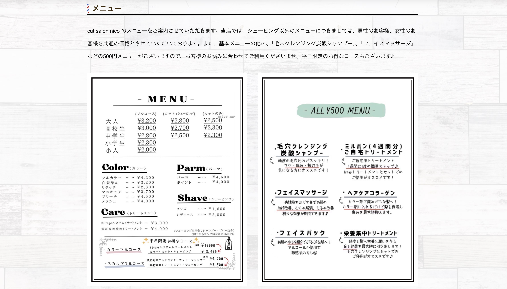

# 2025年2月_進級展作品_「cut salon nico Webサイト」
 

## ▼各種リンク
🔗[cut salon nico Webサイト](https://kanade.raindrop.jp/cutsalonnico/)

🔗[プレゼン用スライドリンク](https://www.canva.com/design/DAGdGROfhhI/TroupHsVM4ccIp99cjBMIg/view)
 
 

## ▼制作背景
2024年10月から2025年2月にかけて、三重県四日市市にある理容室・cut salon nico様にご協力いただき、お店のWebサイトを制作させていただきました。既存のサイトが存在していましたが、異なるページで同じ内容が繰り返されていたり、知りたい情報に少したどり着きづらい印象を受けました。お店の方との打ち合わせの際にも、「とにかくお店の特徴やメニューなど、情報が分かりやすいサイトにしてほしい」とのご要望が真っ先にあり、その点を主軸に制作を進めていくことにしました。
 
 

## ▼制作スケジュール

- **10月7日〜14日：企画書作成**
- **10月17日：お店の方と打ち合わせ、ヒアリング**
- **10月18日〜11月24日：コンテンツマップ、デザイン作成**
- **11月25日〜1月5日：マークアップ**
- **1月6日〜19日：各種資料作成**
- **1月20日〜進級展当日：プレゼン練習・調整**
 

## ▼使用技術・ツール

おもにfigmaはコンテンツマップやデザインデータ作成に使用し、photoshopは画像加工、illustlatorはバナー作成などで使用しました。
 
 

## ▼制作前の課題
### 1. お店の特徴や強みなどの情報が分かりやすいサイトにしたい
・お店の特徴や強み、基本情報などに加えて、理容室ならではのメニューやサービスも豊富で、伝えたい情報が多くありました。

 

### 2. メニューを確認しやすくしたい
・様々な情報の中でも、メニューの料金を確認したいお客様は多いです。お店に訪れることが決まっている方にとっても、他のお店と料金を比較したい方にとっても、メニューはとても大切な情報なので、特に気を配る必要がありました。
・リニューアル前のサイトでは、メニューの画像がそのまま横並びに貼られており、文字が小さく料金を確認しづらいことも課題に感じていました。

> **画像**： リニューアル前のサイト
 

### 3. 女性のお客様も意識したデザインにしてほしい
・女性のお客様を意識したデザインというご要望を受け、お店の雰囲気やターゲット層についても改めて理解を深めました。
単に「女性向け」のデザインに寄せるのではなく、お店のイメージに合った優しさや安心感が感じられるよう意識しました。
デザインを通して「このお店なら安心して通えそう」と思っていただけることを目指しました。

> **画像**： プレゼン用スライド資料から一部抜粋

 
 

## ▼課題の解決方法
### 1.サイト内の構造へのこだわり
- トップページには各ページの重要な部分だけを載せ、まずはサイト内でどんな情報を確認できるのか全体像がつかみやすくなるようにしました。それぞれの情報について一番伝えたいことだけを記載し、詳細についてはボタンを押して各ページへ移動することで確認できるようにしました。

### 2.メニューへの配慮
- 画像をそのまま貼り出すのではなく、table要素を使用して表に作り直しました。

  
### 3.女性も意識しつつ、ニュートラルなデザインに
- 曲線を多く取り入れ、優しい色使いになるよう心がけることで、お店の柔らかい雰囲気を表現し、女性のお客様に来店しやすいと感じていただけるデザインになるよう意識しました。
- 女性を意識しつつも、男性のお客様に来店しづらい印象を与えてしまわないよう、細かい装飾は控え、男女問わず来店しやすいナチュラルで中立的な雰囲気を大切にしました。

